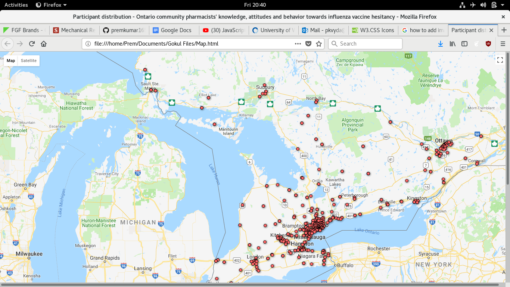
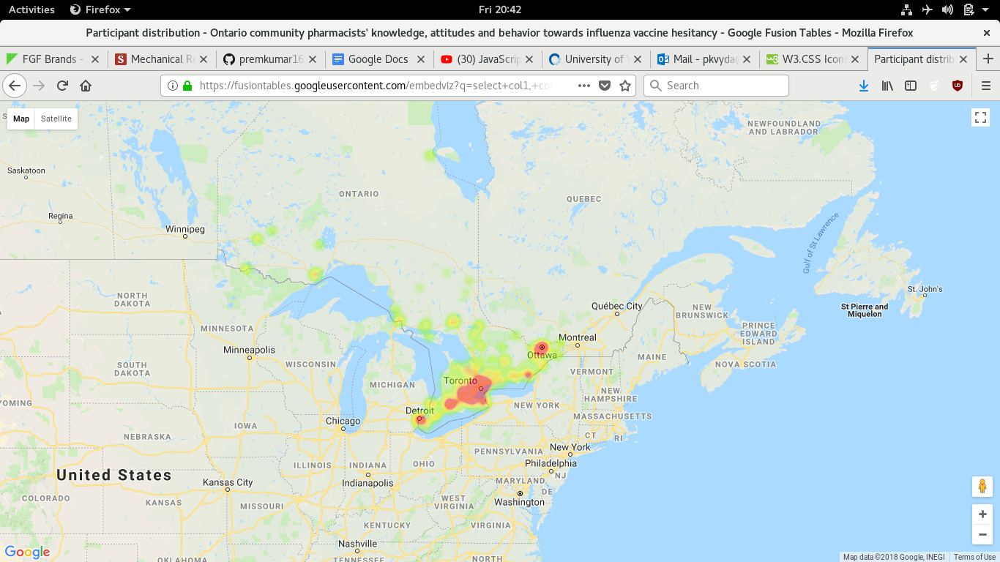

# Google-Fusion-Tables

This is a project undertaken for observing the overall distribution of patients across ontario, as part of a Pharmacy student's study on influenza vaccine hesitancy, and utilized towards his PhD thesis.

Primarily, a google fusion table data of all the postal codes in the province of ontario was obtained from the canadian postal department, and the data was cleaned to represent only the first 3 digits of the code (xxx), and were compared from the data obtained by a survey, and the respondents postal code was sorted according to the respective city. After that, the data is utilized in a google map API to plot the distribution.

# Distribution

# HeatMap

Finally, the distribution and heat map concluded that most of the survey respondents are from the Toronto area, and this provided immense opportunity for the pharmacists, and the government of Ontario to focus their efforts towards increasing the vaccine uptake (influenza vaccine).
